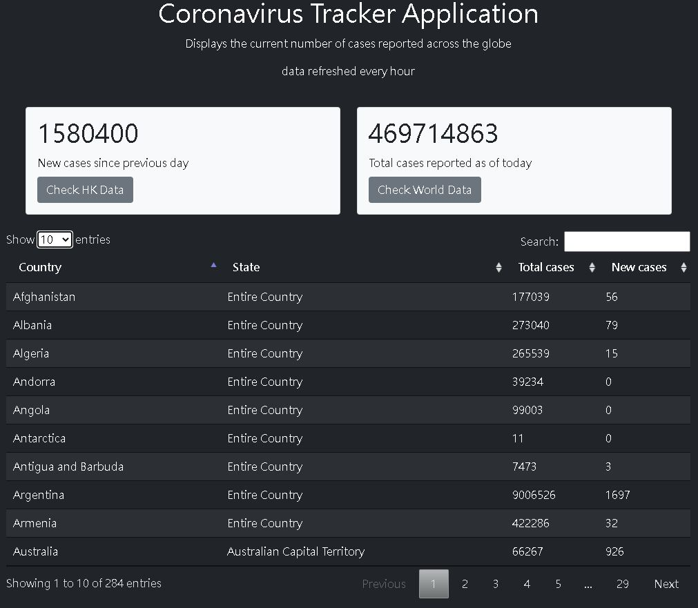
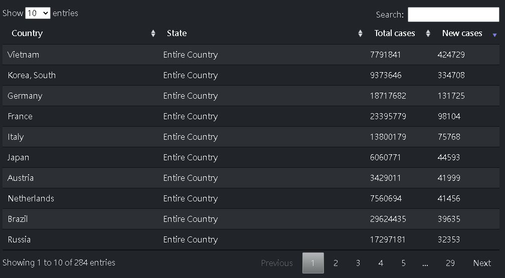
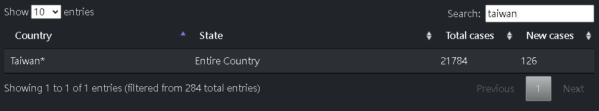

# Corona-Virus-Tracker
a Coronavirus tracker app built with Spring Boot and Java

#Screenshot of the application

# Tools:
Java, SpringBoot, Spring Web, Maven, Themeleaf, Bootstrap, Javascript

# Overview:
- adapted Spring MVC framework to construct an app that tracks covid cases in cities around the globe
- built a Spring service with Java HTTP client that fetches global data from JHU database every hour 
- utilized thymeleaf to construct the landing page and supported keywords filtering/ table sorting with Javascript Datatable library

# Supported Features
- can select entries shown in the page to optimize UI
- can sort alphabatically or numerically on each column

- can search by keywords

